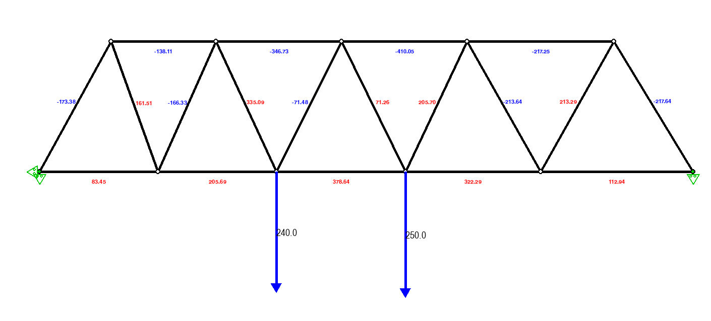

# Pin_Structure_Solver



This project was started in 2022 to save time doing structures in parts 1A and 1B of the cambridge engineering course.
However, its only recently been updated enough to be useful.

# Setup

Install dependencies with Poetry:
```bash
poetry install
poetry run python main.py
poetry run pytest
```

# Layout

`core/` is the solver and the model. It has no rendering dependency and is
meant to stay that way, so it can be tested headless and ported later.

* `core/geometry.py` - 2d vector and line helpers
* `core/model.py` - nodes, members, forces, constraints, truss
* `core/solver.py` - equilibrium assembly and the force solve

`ui/` is the pygame front end: rendering, cursor snapping and the event loop.
`tests/` covers the core against hand calculated trusses.

# Future work
* deflection solving and displaying
* polish and implement snapping to 30 and 45 degree lines
* surd representation for 30 and 45 degree members
* Adding moments to pins

# Extension for statically indeterminate structures
* force method of IB structures course
* FEM 
